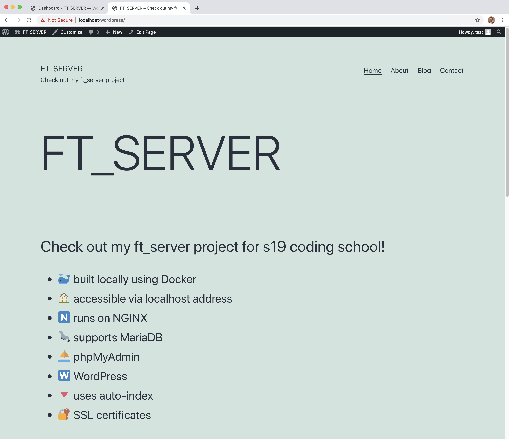
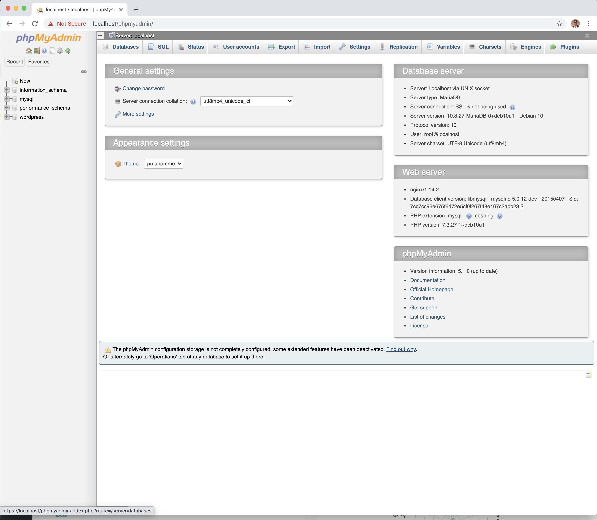
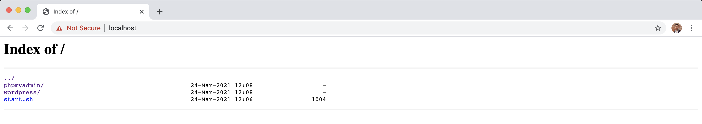

# ft_server
#### A server created and launched locally with Docker, integrated phpMyAdmin, Wordpress, MariaDB and SSL

#### Using dockerfile with a single container, this project allows us to launch the server on any computer with Docker, without worrying about the dependencies and compatibility issues

### Useful links for this project:
- [**How to install LEMP stack on Debian 10 **](https://www.digitalocean.com/community/tutorials/how-to-install-linux-nginx-mariadb-php-lemp-stack-on-debian-10)
- [**Incomplete project guide by a 42 student **](https://forhjy.medium.com/how-to-install-lemp-wordpress-on-debian-buster-by-using-dockerfile-1-75ddf3ede861)

Here below you can see the results in the web browser:
### Wordpress

### PhpMyAdmin

### Auto-Index

